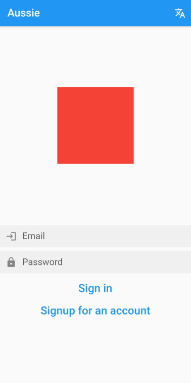
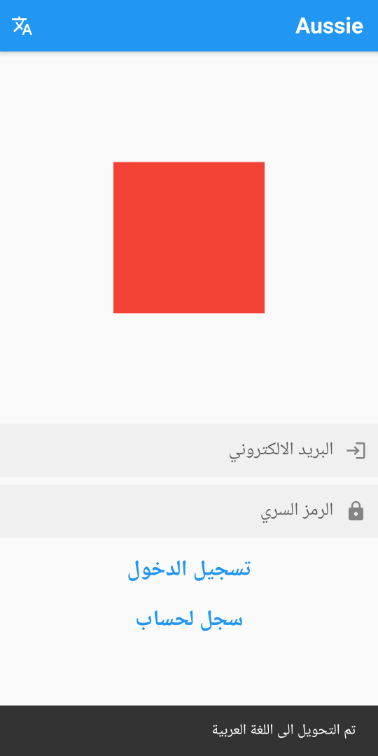
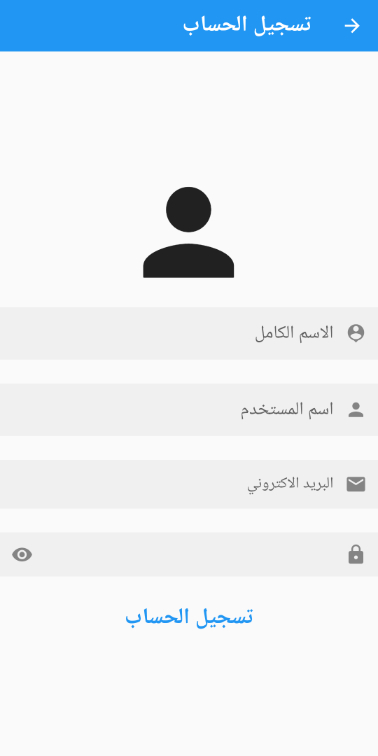
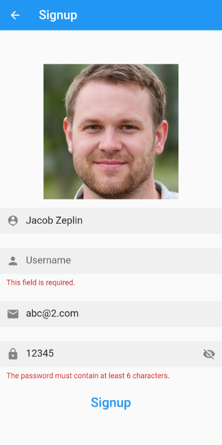

# Contents
- [Contents](#contents)
- [Aussie](#aussie)
- [The Idea](#the-idea)
- [Technical Details](#technical-details)
- [Screenshots](#screenshots)

# Aussie

Aussie originally started as a submission for a competition hosted by the Australian embassy in Jordan with partnership from the Jordan University of Science and Technology (JUST), now I plan to continue working on Aussie as a pet project to perhaps one day distribute it on platform app stores.

# The Idea

One day I was just sitting outside in my yard and thought about the reasons why a big portion of the population tend to stay relatively close to the places they were born in and it hit me; people are lazy, plain and simple, give the ability to be so of course.
You see... often times things like travel and tourisim are thought to be luxuries, these luxuries might not be *that* expensive but their certainly uncomforting, wether it be financially, psychologically or even culturaly, most of time it's the travel anxiety and unceratinty that holds a person from going on a long deserved/dreamt of trip. 

I started Aussie with the end goal being, that is if I win the competition, the ease of travel to Australia,  so easy that your 90 yo granny would have to only do a couple of taps.

# Technical Details
Since this is a pet project I am using it as a basis to learn and close gaps in my programming knowledge.

- Cross platform
  - Through dart/Flutter this app will support various different user platforms, for now Android and IOS though and even the latter is still in early dev cycle..
- Mostly Follows clean code guidelines
  - State is handeled by cubits that interact with repositories, which are middleware that converts raw data to something that can be consumed, and providers, which interface with the outside world apis.
  - Strict linting through the linter package.
- The backend is handeled by FireBase
  - Uses Cloud Firestore as a DB to store the catalouge of fauna, flora, natural park, and teritory features.
  - Cloud Firestore is used to manage user account data.
  - Firebase Auth is used to authinticate users/sign them up.
  - Firebase Storage is used to store media.
- Support for Arabic/English localizations.
- Support for dark mode. 
- Caching and Paging for app data.
- State management with Cubits.
- Forms by FormBloc (Used for signing in/up and event creation).
- Animations using the animations package.
- Persistent state is handeled with SharedPrefrences.

# Screenshots

## This is first screen the users sees/interacts with if they're using it for the first time or if they've signed out of the app.
| Actions Screen (English)                                     | Actions Screen (Arabic)                                    |
| :----------------------------------------------------------- | :--------------------------------------------------------- |
|  |  |

## These show the signup procedure, notably the validation of the fields, planning on adding more options to this.
| Signup                            | Signup validation                                       |
| :-------------------------------- | :------------------------------------------------------ |
|  |  |

## These show the feed, which hosts the events the users creates/pledges to attend.
| Home Feed Empty                                   | Home Feed Populated                               |
| :------------------------------------------------ | :------------------------------------------------ |
|  |  |

| Public Feed                                       |
| :------------------------------------------------ |
|  |

